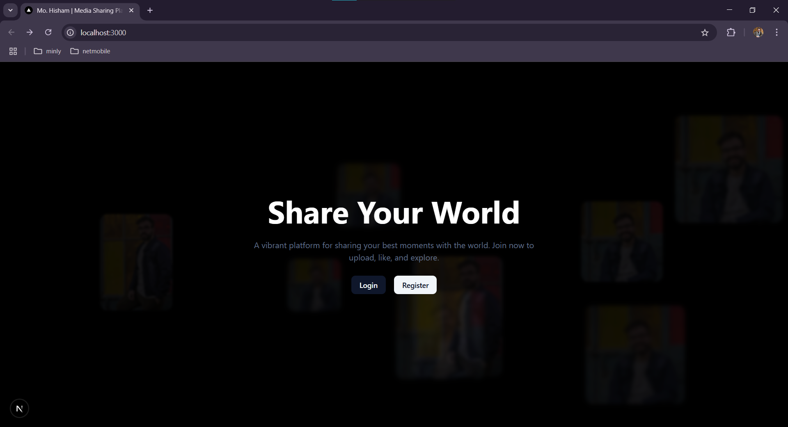
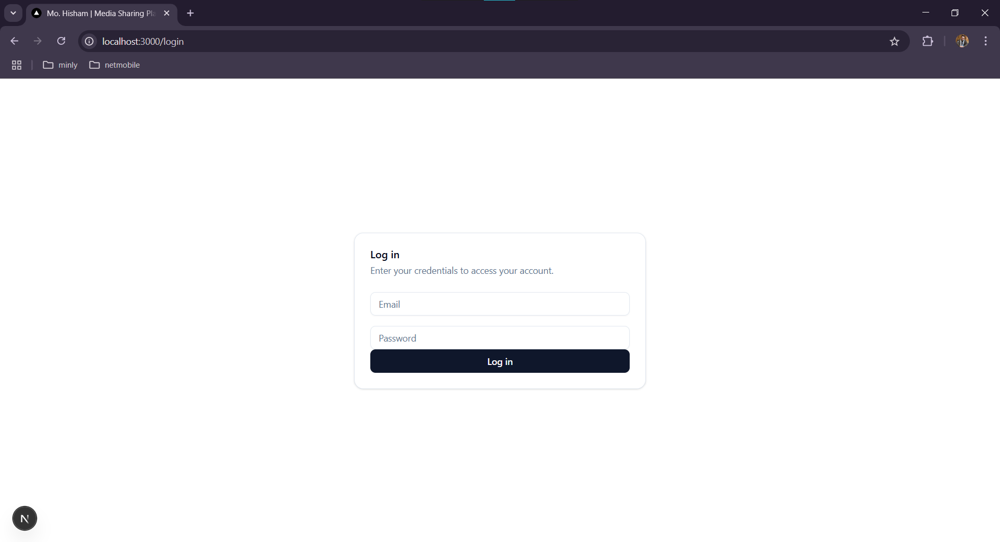
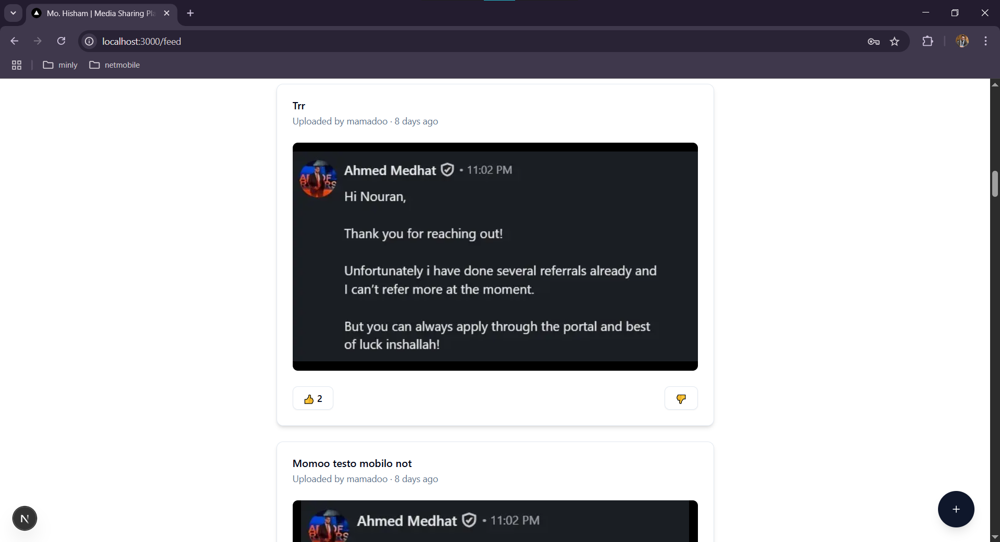

# 📸 Media Sharing Platform

A full-stack media-sharing platform built with:

- 🌐 **Next.js + TailwindCSS + ShadCN** for the web frontend  
- 📱 **React Native (Expo)** for the mobile app  
- ⚙️ **Node.js (Express) + MongoDB** for the backend  
- ☁️ **Cloudinary** for media storage  

---

## 🚀 Features

### 🔐 Authentication
- Secure JWT-based login & registration  
- Token stored in localStorage (web) / AsyncStorage (mobile)  
- Protected API routes using middleware

### 🖼️ Media Feed
- Displays cards with image, uploader, time since upload  
- Like/dislike support  
- Feed sorted by newest uploads

### ⬆️ Upload Media
- Upload photo or video  
- Title + user attached to each post  
- Upload supported on web & mobile

### ❤️ Like & Dislike
- Real-time updates for like/dislike counts  
- Likes tracked per user  

### 🎨 Modern Frontend
- Responsive design using **ShadCN + TailwindCSS**  
- Animated landing page with blurred background previews  
- Live image feed displayed randomly like Netflix-style  

### 📱 Mobile App (React Native)
- Login/logout functionality  
- Authenticated feed & upload  
- Expo-based project  
- Uses same backend as web  

---

## 📷 Screenshots

### 🌐 Web Frontend

#### 🚀 Landing Page with Background Blur  


#### 🔒 Login Page  


#### 🖼️ Feed Page  



---

### 📱 Mobile App

#### 🔐 Login Screen  


#### 📸 Feed with Cards  


#### ⬆️ Upload Screen  


---

## 📂 Project Structure

```bash
.
├── backend/            # Express server + MongoDB
├── frontend/           # Next.js web app
├── mobile/             # React Native app (Expo)
├── README.md
````

---

## 🧪 API Overview

* `POST /auth/register` – Register a new user
* `POST /auth/login` – Login and receive JWT
* `GET /media/public` – Get recent public media (for landing page)
* `GET /media` – Authenticated feed
* `POST /media/:id/like` – Like a post
* `POST /media/:id/dislike` – Dislike a post
* `POST /media/upload` – Upload media (form-data: title, file, userId)

---

## 🧰 Tech Stack

| Layer    | Tech                               |
| -------- | ---------------------------------- |
| Frontend | Next.js, ShadCN UI, TailwindCSS    |
| Backend  | Express.js, MongoDB, Mongoose, JWT |
| Storage  | Cloudinary                         |
| Mobile   | React Native, Expo, AsyncStorage   |
| Auth     | JWT (access token)                 |

---

## 📦 Setup Instructions

### 🔧 Backend

```bash
cd backend
npm install
npm run dev
```

`.env`:

```
MONGO_URI=your_mongo_connection
JWT_SECRET=your_secret
CLOUDINARY_CLOUD_NAME=...
CLOUDINARY_API_KEY=...
CLOUDINARY_API_SECRET=...
```

---

### 🌐 Frontend

```bash
cd frontend
npm install
npm run dev
```

`.env.local`:

```
NEXT_PUBLIC_API_URL=http://localhost:3001
```

---

### 📱 Mobile App

```bash
cd mobile
npm install
npx expo start
```

`.env`:

```
API_URL=http://your-backend-url
```

---

## 🤝 Contributors

* **Mohamed Hisham Abdellatif** – Full-stack Developer

---

## 📄 License

This project is open-source and available under the [MIT License](LICENSE).
